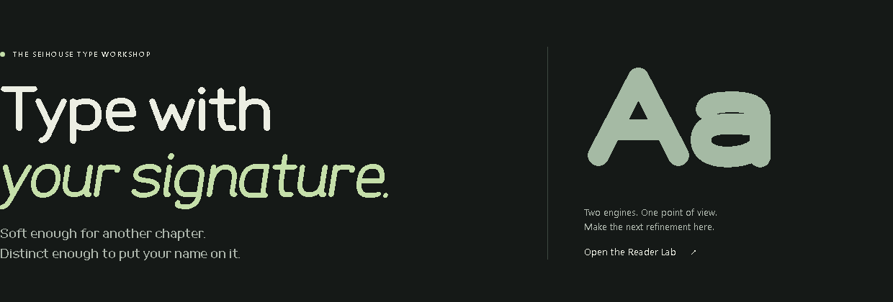
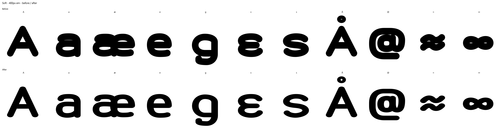
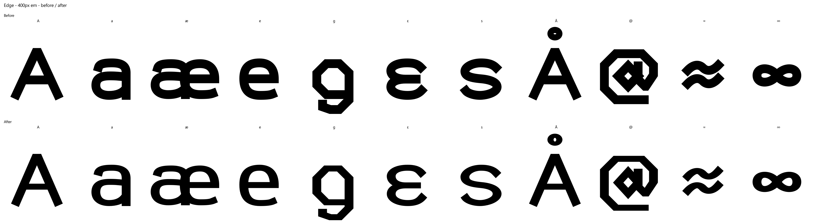

# Display counter repair — 2026-10-06

The homepage's `Aa` sample uses the Soft Display font. Its lowercase `a` had a
nearly closed upper opening: at a 400px em, the remaining enclosed white sliver
covered 150px² but was only four pixels high. The previous shape gate found
spikes, overlap debris and winding problems, but did not measure white-space
clearance inside letters.

The [pre-repair counter report](proofs/display-counter-repair/baseline-counters.json)
reproduces 31 flags under the expanded gate, including the accented `a` family
and Edge's cramped `g` and Greek epsilon apertures.

The shared-engine merge inherited Reader's newer double-storey `a` and level
`e`. The old Display drawing already had tight openings at heavy weights;
the newer construction made Soft's `a` collapse more visibly. The capital `A`
was not a newly broken outline. It benefits from the same counter correction,
with a larger triangular opening and a less crowded crossbar.

## Construction change

The engine maps centerlines inside the requested cap/x-height limits by reserving
a pen radius at each end. Heavy horizontal strokes then consume the remaining
space between stacked bowls and terminals. A weight of 150 with contrast 1
nearly fills the gap above Soft's `a` bowl.

`displayContrast()` in the shared `engine.js` bounds the horizontal pen diameter
to 20% of x-height for round ends, or 15% for extended flat ends. The flat-end
budget accounts for the larger footprint of full perpendicular terminal faces,
including the shared `æ` construction. Vertical stems retain the selected
thickness. A pen already thinner than that limit retains its requested contrast.
This is construction-time optical compensation; it does not carve exported
letter outlines or replace their centerline skeletons.

| Cut | Saved contrast | Effective pen contrast | Selected thickness |
| --- | ---: | ---: | ---: |
| Soft | 1 | 1.4423076923 | 150 |
| Edge | 1 | 1.4743589744 | 115 |
| Ink | 2.6 | 2.6 | 135 |
| Wide | 1 | 1 | 55 |

The Display Lab and `FontBuilderCore.export()` invoke the same JavaScript
function. Pen expansion, height normalization, marks and measured kerning use
that effective pen. Drafts and cut JSON retain the user's requested settings.
Reader does not invoke Display compensation, so its drawings and fonts remain
unchanged. Both Labs were regenerated from the shared source.

Cut JSON hashes, skeleton hashes, every Display advance and all recorded vertical
metrics still match the existing frozen design gates. Edge retains its previously
released 2220-unit Windows clipping ascent even though its newly compensated
accent stacks now need less room. The original Vietnamese clipping regression
uses a frozen pre-repair subset rather than assuming new contours must still clip.

## Expanded gate

`display/counter_geometry.py` checks the actual 400px native font rasters:

- A substantial enclosed white counter must retain room after a three-pixel
  diamond dilation of the ink (a six-pixel clearance test).
- A substantial letter/number basin connected to the outside must not become
  enclosed by that dilation; this detects a pinched aperture.
- An immutable approved topology fixture records substantial closed-counter
  counts and white-space witnesses for all 590 letter/number glyphs per cut.
  Witnesses sit inside reviewed counters or open interior basins, have three
  pixels of ink clearance and use glyph coordinates. Filled counters, filled
  interiors, opened counters and sealed apertures fail even when the remaining
  raster has ample clearance. The gate rejects missing baseline glyphs and
  never regenerates this fixture from fonts being tested.
- Closed counters must cover at least 24px² and span 20% of the glyph's width
  or height. Aperture basins must cover at least 200px² and 2% of the glyph box.
  These limits distinguish letter counters from small hooks, accent rings and
  deliberate symbol details. Exterior spaces between beamed music-note stems
  are not treated as letter apertures; their closed counters and all existing
  geometry checks are still tested.

These are raster quality thresholds, not a proof of typography at every possible
slider setting or reading size. All four canonical cuts are checked. The original
micro-contour, segment, spike, overlap, fill-rule and web-render gates remain.
The tests contain an immutable subset of the shipped broken Soft `a`, plus
adversarial thin counters and open basins; disabling the repair fails the shipped
`a` family regression. Historical Step 1/2 reports and identity fixtures were
not rewritten.

Topology regressions also include a completely filled counter and a sealed roomy
aperture, both of which pass clearance-only analysis. Independent expected counts
and witness connectivity reject those mutations, including a completely filled
open interior. A bounding-box shift test protects glyph-coordinate alignment.

## Evidence

- [Expanded shape report](proofs/display-counter-repair/shapes.json): all 2,928
  glyph outlines and 5,856 OTF/WOFF2 renders at 400px, zero flags.
- [Shared-engine preservation and layout](proofs/display-counter-repair/shared-engine.json):
  all 90 Reader assets byte-identical; all ten historical styles preserved;
  every Display cut retains 732 glyphs and passes 3,339 shaping strings across
  34 language inventories/samples, with zero flags.
- [Unchanged cut rebuilds](proofs/display-counter-repair/unchanged-cuts.json): Ink
  and Wide were rebuilt; all normalized SFNT tables match their shipped fonts.
  Their existing asset bytes are retained to avoid timestamp-only churn.
- [FontBakery](proofs/display-counter-repair/fontbakery.json): all four cuts pass
  Universal with `--skip-network` and OpenType, zero FAIL/WARN/ERROR/FATAL.
- [Browser proof](proofs/display-counter-repair/browser.json): the built homepage
  loads the actual Soft web font; all four live Lab samples render correctly;
  the mobile homepage remains usable, with no browser errors.




Native 400px specimens, before and after:





Live Lab specimens are also saved beside these proofs for all four cuts.
The complete all-glyph proof sheets were generated in `dist/counter-all-glyph-proofs`;
pass `--proof-dir` to regenerate them during a verification run.

Reproduce the verification:

```powershell
.venv/Scripts/python.exe -X utf8 -m unittest discover -s tests -p 'test_*.py'
node --test tests/shared-engine.test.mjs tests/display-strokes.test.mjs tests/site.test.mjs
.venv/Scripts/python.exe -X utf8 verify_display_shapes.py --report dist/counter-shapes.json
.venv/Scripts/python.exe -X utf8 verify_shared_engine.py --report dist/counter-preservation.json
node build_site.mjs
```

To rebuild, use the existing `display/make_display.py` for each unchanged cut JSON.
The CI shared-builder job independently rebuilds Reader and all four Display cuts
and gates those candidate fonts, in addition to checking the delivered assets.
