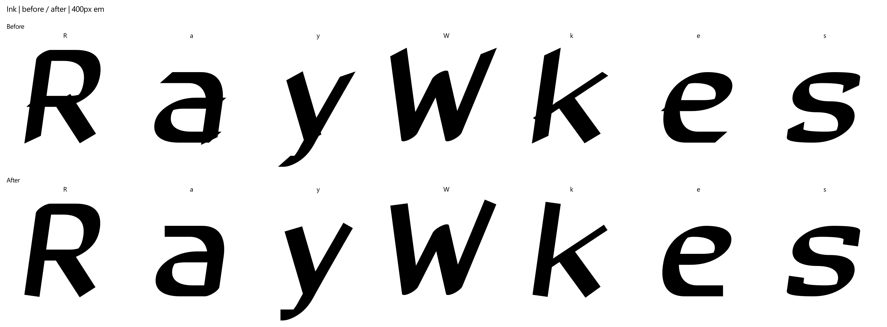
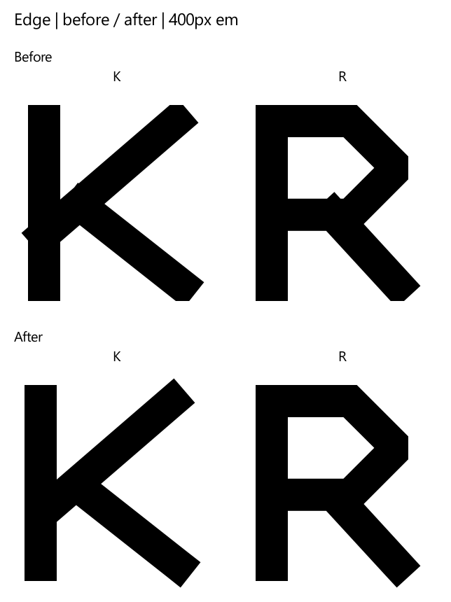

# Display Engine Step 1: clean shapes

Historical Step 1 build, checked 3 October 2026. Soft, Edge, Ink and Wide retain their original cut JSON,
letter skeletons, glyph inventory, advance widths and vertical metrics.
The cut version remains 0.1. All eight OTF/WOFF2 files were rebuilt.

The later [shared-engine build](DISPLAY-SHARED-ENGINE-STEP2.md) expands the glyph
inventory. This report and its checked-in proof files preserve the Step 1
results; current source rebuilds use the shared engine and its larger inventory.

## Construction

Flat terminals now meet a face perpendicular to the final stroke tangent,
including Ink's pen rotation and oblique slant. The oval-pen offset walls join
that face directly. A terminal attached to another stroke or its own stem has
no exposed cap. Coincident terminal rays receive the configured round or sharp
join, so removing the caps does not open an outer-corner notch.

Sharp joins use a miter limit of 2, with the stroker's bevel fallback for longer
miters. A global horizontal clip no longer cuts through angled terminal faces.
These are shared construction rules; there are no glyph-specific patches.

`display/outline_cleanup.py` resolves self-overlaps and winding, removes
micro-contours, collapses near-duplicate points and removes short spikes or
out-and-back spurs/notches. It keeps native Bezier curves and full-size symbol
tips. Cleanup runs after stroking/union, after slant, and after curve fitting
and whole-unit rounding before CFF encoding. Hinting must succeed before web
export. The live Lab uses the same terminal geometry and miter rule, with
overlap inside the body to prevent SVG antialiasing seams at separate caps.

Automatic pairs were recalculated from the repaired silhouettes. Cut tracking,
manual pairs, sidebearing settings, advance widths and letter skeletons were
not tuned. The Reader/Sans family is outside this change.

## Shape gate

`verify_display_shapes.py` reads the finished hinted CFF, examines every
contour and rasterizes every glyph ID at a 400px em through FreeType. It also
checks both font formats for identical outlines, metrics, OpenType layout and
raster output. This covers `.notdef`, the empty space glyph, all letters,
accents, ligatures and symbols. Unicode/PUA aliases share their glyph IDs.

| Cut | Glyphs | OTF + WOFF2 renders | Before flags | After flags |
|---|---:|---:|---:|---:|
| Soft | 241 | 482 | 154 | 0 |
| Edge | 241 | 482 | 26 | 0 |
| Ink | 241 | 482 | 200 | 0 |
| Wide | 241 | 482 | 94 | 0 |
| Total | 964 | 1,928 | 474 | 0 |

A flag is an outline event, not necessarily a separate glyph. A single overlap
may trigger both the self-overlap and fill-rule-disagreement checks.
The gate returns a nonzero exit status for any flag.

At 400px the thresholds are: contours below 1px²; segments below 0.4px;
needle turns over 150° with a shoulder below 8px; small opposing-root
spur/notch turns with shoulders below 16px/24px; and overlap/fill-rule
disagreement above 0.25px². Corners are measured 2px from the junction to
ignore rounding noise in tiny curve controls. Long intentional letter and
symbol corners remain valid. `design.json` gates the unchanged controls,
skeleton source, original inventory, advances and line metrics.

Ten Python construction regressions cover angled/slanted caps, attached
branches, coincident terminals, bevel fallback, spikes, notches, micro-contours,
near-duplicate points, overlap winding and counter/dot survival. Four Node
regressions cover the live terminal construction. The `display-shapes` Actions
job runs both suites and the zero-flag gate on the shipped fonts.

## Proofs and provenance

The original fonts came from commit
`bc61d90d25730f7768b92f51e190221045810e9a`. Their SHA-256 values are in
[before.json](proofs/display-step1/before.json); the rebuilt file hashes and
zero-flag results are in [after.json](proofs/display-step1/after.json).
All alphabet sheets retain a 400px em and paginate every glyph, rather than
shrinking glyphs to fit.





| Cut | Before sheets | After sheets |
|---|---|---|
| Soft | [1](proofs/display-step1/before/soft-01.png), [2](proofs/display-step1/before/soft-02.png), [3](proofs/display-step1/before/soft-03.png), [4](proofs/display-step1/before/soft-04.png) | [1](proofs/display-step1/after/soft-01.png), [2](proofs/display-step1/after/soft-02.png), [3](proofs/display-step1/after/soft-03.png), [4](proofs/display-step1/after/soft-04.png) |
| Edge | [1](proofs/display-step1/before/edge-01.png), [2](proofs/display-step1/before/edge-02.png), [3](proofs/display-step1/before/edge-03.png), [4](proofs/display-step1/before/edge-04.png) | [1](proofs/display-step1/after/edge-01.png), [2](proofs/display-step1/after/edge-02.png), [3](proofs/display-step1/after/edge-03.png), [4](proofs/display-step1/after/edge-04.png) |
| Ink | [1](proofs/display-step1/before/ink-01.png), [2](proofs/display-step1/before/ink-02.png), [3](proofs/display-step1/before/ink-03.png), [4](proofs/display-step1/before/ink-04.png) | [1](proofs/display-step1/after/ink-01.png), [2](proofs/display-step1/after/ink-02.png), [3](proofs/display-step1/after/ink-03.png), [4](proofs/display-step1/after/ink-04.png) |
| Wide | [1](proofs/display-step1/before/wide-01.png), [2](proofs/display-step1/before/wide-02.png), [3](proofs/display-step1/before/wide-03.png), [4](proofs/display-step1/before/wide-04.png) | [1](proofs/display-step1/after/wide-01.png), [2](proofs/display-step1/after/wide-02.png), [3](proofs/display-step1/after/wide-03.png), [4](proofs/display-step1/after/wide-04.png) |

Chromium generated all 239 engine glyphs at 300/400/800px in each live cut,
tested all four preset controls and the 390px layout, and reported no page
errors. The 400px live specimens and [lab.json](proofs/display-step1/lab.json)
record that separate preview check.

## FontBakery

FontBakery 1.1.0 checked each OTF separately, with no excluded check IDs.
The Universal profile used `--skip-network`; online-only checks were skipped.

| Cut | Universal PASS | OpenType PASS | FAIL | WARN | ERROR / FATAL |
|---|---:|---:|---:|---:|---:|
| Soft | 71 | 28 | 0 | 0 | 0 |
| Edge | 71 | 28 | 0 | 0 | 0 |
| Ink | 71 | 28 | 0 | 0 | 0 |
| Wide | 71 | 28 | 0 | 0 | 0 |

The [FontBakery summary](proofs/display-step1/fontbakery.json) includes counts,
profile coverage and the exact checked OTF hashes. Each Universal run also
reported 3 INFO / 53 SKIP; each OpenType run reported 25 SKIP.

## Reproduce

From the repository root, with `requirements.txt` installed and Chromium
available to Playwright:

```powershell
foreach ($cut in 'soft','edge','ink','wide') {
  python -X utf8 display/make_display.py "display/cuts/$cut.json"
}
python -X utf8 display/build_display_page.py
python -X utf8 -m unittest discover -s tests -p test_display_shapes.py -v
node --test tests/display-strokes.test.mjs tests/site.test.mjs
python -X utf8 verify_display_shapes.py --proof-dir dist/display-shapes-proofs --report dist/display-shapes.json
foreach ($cut in 'Soft','Edge','Ink','Wide') {
  $font = "display/fonts/$($cut.ToLower())/SEIHouseDisplay-$cut.otf"
  fontbakery check-universal --skip-network -n -C -e WARN $font
  fontbakery check-opentype -n -C -e WARN $font
}
```

Current rebuilds reproduce the shared-engine inventory. Write new proofs to
`dist/` as above to keep this historical validation snapshot intact.

To regenerate the compact comparison, pass `--compare-fonts` pointing to a
directory containing the original `soft/edge/ink/wide` font directories.
The original baseline used locally is in the ignored
`dist/display-shapes-baseline/fonts` directory. It is intentionally expected to
fail the new gate when supplied through `--fonts`.

For the live Lab check, serve the repository with
`python -m http.server 8766 --bind 127.0.0.1`, then run
`python -X utf8 display/verify_lab.py --proof-dir dist/display-lab-proofs` in
another terminal.
