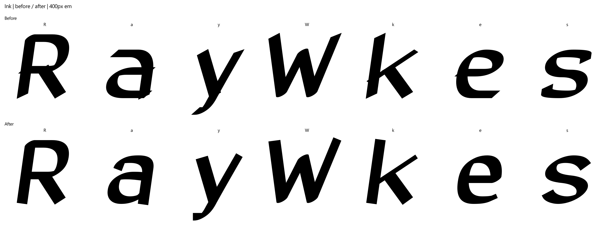

# Display Engine Step 2: one shared engine

Reader and Display use the root `engine.js` and `font_builder.py`. The forked
`display/engine.js` is deleted. All four Display cuts retain their JSON settings
and version 0.1 while inheriting the current Reader repertoire and layout.

## Shared construction

`make_fonts.py` loads Reader settings and builds the ten upright/italic styles
and their web subsets. `display/make_display.py` loads one cut and builds its
OTF/WOFF2 pair. Both call `FontBuilderCore`; export, metrics, spacing, alternate
construction, mark/local forms, OpenType features and hinting have one owner.
The core keeps build settings and kerning maps on each instance.

The Reader defaults remain soft corners, round ends, round joins and
`penAngle: 0`. Existing true italics retain their letter substitutions and
9-degree slant. Display settings expose `corners: soft|cut`, `ends: round|flat`,
`joins: round|sharp`, `penAngle` and `slant`. Explicit oblique slant shears the
upright letter forms without selecting italic substitutions.

The configured construction retains Step 1's perpendicular flat faces,
attached-terminal handling, miter limit of 2 with bevel fallback, and cleanup
after stroking, slant, fitting and integer rounding. Reader's unchanged default
path keeps the approved 0.35 overlap repair and curve fitting. Both Labs embed
the same root engine; the Display SVG helper supplies the configured pen's
terminal geometry for its live preview.

## Inherited repertoire and features

The current shared repertoire comes from Reader 0.39 at commit
`a9427a35817b482f5672e7c4a508254e031a94a9`. It contains 732 font glyphs:
696 encoded engine entries, 34 unencoded alternates, `.notdef` and space.
Unicode and private-use aliases reuse glyph IDs, giving 714 encoded codepoints.

Display inherits the original Latin foundation and the complete Latin
Extended-A additions, modern Cyrillic and monotonic Greek, and Vietnamese
vowels with horn/breve/circumflex and tone stacks. Reader's true italic
Cyrillic substitutions stay in the italic styles; Display's oblique cuts keep
upright letter forms. The shared mark repertoire retains zero advances,
classification, attachment and dotless forms.

The common layout includes canonical composition (`ccmp`), base and ligature
mark attachment (`mark`), stacked marks (`mkmk`), Turkish dotted-i and Romanian
comma forms (`locl`), and Hungarian capital digraph spacing. It also includes
fractions (`frac`), tabular figures (`tnum`), superscripts (`sups`), subscripts
(`subs`), and decimal period/comma spacing in proportional and tabular modes.
New script spacing and stacked Vietnamese composition use the same current
Reader code.

The pinned `languages.json` inventory now has 21 locales. It retains Polish,
Czech, Hungarian, Romanian, Turkish, Hausa, Kurdish (Kurmanji, Latin), Māori,
Igbo and Uzbek (Latin), and adds Slovak, Croatian, Slovenian, Russian,
Ukrainian, Belarusian, Bulgarian, Serbian, Macedonian, monotonic Greek and
Vietnamese. The shared audit also checks the established Latin foundation
samples for English, Spanish, French, Portuguese, German, Italian, Dutch,
Catalan, Danish, Norwegian, Swedish, Finnish and Icelandic: 34 language
inventories/samples altogether. Coverage and shaping checks use the scope
defined in the [Phase 4 notes](../README.md#phase-4-additive-language-expansion) and do not constitute
native-reader certification.

## Display metrics inherited from Reader

Retiring the 0.25 fork also adopts Reader's existing 0.28 width and bearing
refinements. Twenty previously encoded glyph advances change in each cut:
`a` and its six accents, `e` and its four accents, `i` and its four accents,
`æ`, `œ` and `fi`. These changes come from the inherited Reader construction;
cut JSON remains unchanged. Every other previous advance and every previous
encoded mapping are retained. Typographic line spacing and baselines are
unchanged; Edge has one required clipping-extent adjustment for the newly
inherited Vietnamese tone stacks.

The table gives advance changes in font units at the 2,000-unit em. Cut width
scales the inherited `a`/`e` changes; the `i`/`fi` bearing increase is 24 units.

| Glyph group | Glyphs | Soft | Edge | Ink | Wide |
|---|---:|---:|---:|---:|---:|
| `a à á â ã ä å` | 7 | −52 | −50 | −45 | −70 |
| `e è é ê ë` | 5 | −46 | −44 | −40 | −62 |
| `i ì í î ï` | 5 | +24 | +24 | +24 | +24 |
| `æ œ` | 2 | −46 | −44 | −40 | −62 |
| `fi` | 1 | +24 | +24 | +24 | +24 |

[`display-step2-design-0.39.json`](../tests/fixtures/display-step2-design-0.39.json)
freezes all 732 current advances per cut and records the before/after value and
source reason for each of the twenty inherited changes. The design gate
requires those exact values, the original controls and aliases, the protected
vertical metrics, and Reader's unchanged shared skeleton source.

Edge's new `Ố`/`Ồ` outlines reach font-unit y=2,220, above its original
`OS/2.usWinAscent` of 2,200. The shared core derives Display clipping extents
from the final CFF ink bounds, so Edge's `usWinAscent` becomes 2,220. Its
`hhea` and `sTypo` ascent/descent/line-gap fields, all other protected vertical
fields and every cut setting stay unchanged. The fixture records this exact
20-unit exception and its source reason; the gate rejects broader metric
changes. Reader's metrics remain unchanged.

## Reader preservation and the byte-identity reason

The final preservation baseline is Reader 0.39 at commit
`a9427a35817b482f5672e7c4a508254e031a94a9`. This keeps the latest Reader
release and all of its additive scripts while consolidating the engines.
Reader family/version metadata comes from `phase4.json`; approved design
settings in `settings.json` remain unchanged. The ten styles have ninety
font deliveries: ten full OTFs, ten full WOFF2 files and seventy subsets.

`tests/fixtures/reader-engine-0.39.json` fingerprints the complete encoded and
alternate engine exports for all ten styles from that committed release.
The Node regression requires exact export identity; it also projects the
historical 383 encoded entries and 34 alternates onto the unchanged original
`reader-engine-0.35.json` fixture. Option-sensitive caching, oblique slant
without italic substitutions and all 730 encoded/alternate live drawings
per cut are checked separately.

`tests/fixtures/reader-0.39-identity.json` fingerprints all ninety files
directly from that committed release. `verify_shared_engine.py` compares
every SFNT table, including complete CFF outline and hint programs, metrics,
names and layout. Only `head.created`, `head.modified` and
`head.checkSumAdjustment` are normalized. Rebuilding stamps new
creation/modification times and consequently a new checksum; these bookkeeping
values are the written reason for accepting outline/metric identity for the
rebuilt candidate instead of requiring whole-file byte identity. No design,
hint, name or layout field is omitted from the current-release comparison.

The requested original 0.35 glyphs are protected independently by
`tests/fixtures/reader-0.35-original-glyphs.json`: all 419 original decomposed
outlines, complete horizontal metrics, encoded aliases and vertical metrics
across all ten styles. The complete current font differs from the old release
because 0.36 introduced the SEIHouse Sans name/license metadata and 0.37–0.39
added encoded letters, composition/layout and script deliveries. Additional
glyphs can change CFF subroutine organization and hint records; the current
0.39 comparison still requires those programs and hints to match exactly.

The initial consolidation against Reader 0.36 is retained as historical
evidence in [reader-0.36-rebuilt.json](proofs/display-step2/reader-0.36-rebuilt.json)
and [shared-engine-0.36.json](proofs/display-step2/shared-engine-0.36.json).
Those reports cover fifty 0.36 files and the former 419-glyph Display build.
All fifty rebuilt deliveries matched normalized tables and CFF outline/hint
programs, and all fifty matched the preserved 0.35 geometry, metrics and
layout, with zero preservation flags. The historical 0.36 fingerprints and
ten-style engine export fixture remain available alongside the current
release fixtures.

Final current-release results are recorded separately in
[reader-rebuilt.json](proofs/display-step2/reader-rebuilt.json) and
[shared-engine.json](proofs/display-step2/shared-engine.json). All ninety
rebuilt deliveries match normalized current-release tables and complete CFF
outline/hint programs, with zero preservation flags. Every original 0.35
outline and metric also matches in the ten styles. The checked-in Reader
binaries are retained from the current 0.39 baseline, keeping those ninety
delivered files byte-identical while the separate rebuild report proves the
new core's output.

## Evidence and historical proofs

Step 1's [construction report](DISPLAY-SHAPES-STEP1.md) and
[`proofs/display-step1/`](proofs/display-step1/after.json) remain frozen. They
describe the earlier 241-glyph cut builds: 964 outlines and 1,928 OTF/WOFF2
renders, with 474 baseline outline events reduced to zero.

Step 2's expanded builds have a fresh shape report and fresh proofs. The
shape thresholds remain the Step 1 thresholds at a 400px em, with every glyph
ID rasterized in both formats. The design gate retains the original cut JSON,
encoded mappings and typographic line spacing while permitting inherited
Reader additions, the twenty documented advance refinements and Edge's
20-unit clipping-extent adjustment above. It freezes
every current advance and fingerprints the unchanged shared Reader skeleton
source because the old Display fork has been deleted.

The [shape report](proofs/display-step2/shapes.json) records **zero flags** for
all 2,928 glyph outlines and 5,856 OTF/WOFF2 renders. Both formats agree on
outlines, metrics, vertical metrics, layout and raster output. Empty outlines
are accepted only for the declared space glyphs; missing letter ink also
fails the gate.

The [shared-engine report](proofs/display-step2/shared-engine.json) records
zero preservation/feature flags, all ninety shipped Reader files byte-identical
to the latest 0.39 baseline, and 3,339 language shaping strings per cut across
34 inventories/samples. Mark attachment/stacking, local forms, numeric
substitutions, feature ordering and decimal spacing pass the behavior checks.
The [rebuilt Reader audit](proofs/display-step2/reader-rebuilt.json) separately
proves all ninety regenerated deliveries match normalized current tables,
complete CFF outlines/hints and the original 0.35 glyph outlines/metrics.

FontBakery 1.1.0 checked every cut separately with no excluded check IDs. Each
Universal run used `--skip-network` and reported 75 PASS / 3 INFO / 49 SKIP;
each OpenType run reported 31 PASS / 22 SKIP. All four cuts have **0 FAIL /
0 WARN / 0 ERROR / 0 FATAL**. The
[FontBakery summary](proofs/display-step2/fontbakery.json) and shape report
identify the same final OTF hashes, including Edge's corrected clipping ascent.

| Cut | Glyphs | OTF + WOFF2 renders | Shape flags | Universal PASS | OpenType PASS |
|---|---:|---:|---:|---:|---:|
| Soft | 732 | 1,464 | 0 | 75 | 31 |
| Edge | 732 | 1,464 | 0 | 75 | 31 |
| Ink | 732 | 1,464 | 0 | 75 | 31 |
| Wide | 732 | 1,464 | 0 | 75 | 31 |
| Total | 2,928 | 5,856 | 0 | 300 | 124 |

The final construction and preservation regressions pass: 39 Python tests and
21 Node tests. The Phase 4 current-baseline audit preserves all 732 glyphs,
pairs and layout in the ten styles and all seven script/subset deliveries,
and passes 33,300 language strings. License checks cover all ninety current
font files. Reader app distribution checks pass with the latest package scope.

The [Chromium Lab report](proofs/display-step2/lab.json) records all 696 encoded
engine entries at 300/400/800px in every live cut: 2,088 SVG instances per cut.
It also checks all preset buttons and the 390px layout, with zero page errors.
The separate Node regression constructs all 730 encoded/alternate live
drawings per cut and checks finite geometry.

Each of the 48 proof sheets keeps the 400px em and paginates every glyph ID.
The compact comparisons use the original 0.1 fonts beside the final shared
0.39-engine builds. The earlier Step 1 comparison remains available in its
historical report.




| Cut | Final 400px glyph sheets | Live 400px specimen |
|---|---|---|
| Soft | [1](proofs/display-step2/after/soft-01.png), [2](proofs/display-step2/after/soft-02.png), [3](proofs/display-step2/after/soft-03.png), [4](proofs/display-step2/after/soft-04.png), [5](proofs/display-step2/after/soft-05.png), [6](proofs/display-step2/after/soft-06.png), [7](proofs/display-step2/after/soft-07.png), [8](proofs/display-step2/after/soft-08.png), [9](proofs/display-step2/after/soft-09.png), [10](proofs/display-step2/after/soft-10.png), [11](proofs/display-step2/after/soft-11.png), [12](proofs/display-step2/after/soft-12.png) | [Soft](proofs/display-step2/lab-soft-400.png) |
| Edge | [1](proofs/display-step2/after/edge-01.png), [2](proofs/display-step2/after/edge-02.png), [3](proofs/display-step2/after/edge-03.png), [4](proofs/display-step2/after/edge-04.png), [5](proofs/display-step2/after/edge-05.png), [6](proofs/display-step2/after/edge-06.png), [7](proofs/display-step2/after/edge-07.png), [8](proofs/display-step2/after/edge-08.png), [9](proofs/display-step2/after/edge-09.png), [10](proofs/display-step2/after/edge-10.png), [11](proofs/display-step2/after/edge-11.png), [12](proofs/display-step2/after/edge-12.png) | [Edge](proofs/display-step2/lab-edge-400.png) |
| Ink | [1](proofs/display-step2/after/ink-01.png), [2](proofs/display-step2/after/ink-02.png), [3](proofs/display-step2/after/ink-03.png), [4](proofs/display-step2/after/ink-04.png), [5](proofs/display-step2/after/ink-05.png), [6](proofs/display-step2/after/ink-06.png), [7](proofs/display-step2/after/ink-07.png), [8](proofs/display-step2/after/ink-08.png), [9](proofs/display-step2/after/ink-09.png), [10](proofs/display-step2/after/ink-10.png), [11](proofs/display-step2/after/ink-11.png), [12](proofs/display-step2/after/ink-12.png) | [Ink](proofs/display-step2/lab-ink-400.png) |
| Wide | [1](proofs/display-step2/after/wide-01.png), [2](proofs/display-step2/after/wide-02.png), [3](proofs/display-step2/after/wide-03.png), [4](proofs/display-step2/after/wide-04.png), [5](proofs/display-step2/after/wide-05.png), [6](proofs/display-step2/after/wide-06.png), [7](proofs/display-step2/after/wide-07.png), [8](proofs/display-step2/after/wide-08.png), [9](proofs/display-step2/after/wide-09.png), [10](proofs/display-step2/after/wide-10.png), [11](proofs/display-step2/after/wide-11.png), [12](proofs/display-step2/after/wide-12.png) | [Wide](proofs/display-step2/lab-wide-400.png) |

## Reproduce

With `requirements.txt` installed, Playwright Chromium available and
`otfautohint` in the Python environment, run from the repository root:

```powershell
python -X utf8 make_fonts.py
foreach ($cut in 'soft','edge','ink','wide') {
  python -X utf8 display/make_display.py "display/cuts/$cut.json"
}
python -X utf8 display/build_display_page.py
python -X utf8 verify_phase4.py --baseline a9427a3
node --test tests/shared-engine.test.mjs tests/display-strokes.test.mjs tests/site.test.mjs
python -X utf8 -m unittest discover -s tests -p 'test_*.py' -v
python -X utf8 verify_shared_engine.py --report dist/shared-engine.json
python -X utf8 verify_display_shapes.py --proof-dir dist/display-step2-proofs --report dist/display-shapes.json
foreach ($cut in 'Soft','Edge','Ink','Wide') {
  $font = "display/fonts/$($cut.ToLower())/SEIHouseDisplay-$cut.otf"
  fontbakery check-universal --skip-network -n -C -e WARN $font
  fontbakery check-opentype -n -C -e WARN $font
}
```

To inspect the live Display Lab, serve the repository with
`python -m http.server 8766 --bind 127.0.0.1`, then run
`python -X utf8 display/verify_lab.py --proof-dir dist/display-lab-proofs` in
another terminal.
